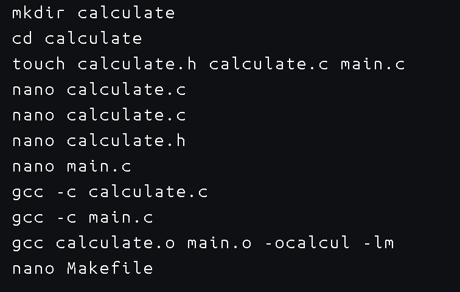
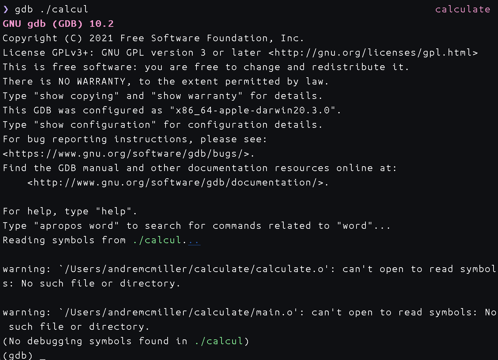

---
## Front matter
lang: ru-RU
title: Отчёт по лабораторной работе №14
author: Миниханов Андрей Русланович
institute: РУДН, Москва, Россия
date: 5 июня 2021

## Formatting
toc: false
slide_level: 2
theme: metropolis
header-includes: 
 - \metroset{progressbar=frametitle,sectionpage=progressbar,numbering=fraction}
 - '\makeatletter'
 - '\beamer@ignorenonframefalse'
 - '\makeatother'
aspectratio: 43
section-titles: true
---

## Цель работы

Приобрести простейшие навыки разработки, анализа, тестирования и отладки приложений в ОС типа UNIX/Linux на примере создания на языке программирования С калькулятора с простейшими функциями.

## Создал каталог и файлы в нём

В домашнем каталоге создаю подкаталог calculate с помощью команды «mkdir calculate». Создал в каталоге файлы: calculate.h, calculate.c, main.c, используя команды «cd calculate» и «touch calculate.h calculate.c main.c» (рис. -@fig:001).

{ #fig:001 width=70% }

## Выполнил компиляцию программы посредством gcc

Выполнил компиляцию программы посредством gcc, используя команды «gcc -c calculate.c», «gcc -c main.c» и «gcc calculate.o main.o -o calcul -lm» (рис. -@fig:002).

{ #fig:002 width=70% }

## Создал Makefile с необходимым содержанием

Создал Makefile с необходимым содержанием (рис. -@fig:003). Данный файл необходим для автоматической компиляции файлов calculate.c (цель calculate.o), main.c (цель main.o), а также их объединения в один исполняемый файл calcul (цель calcul). Цель clean нужна для автоматического удаления файлов. Переменная CC отвечает за утилиту для компиляции. Переменная CFLAGS отвечает за опции в данной утилите. Переменная LIBS отвечает за опции для объединения объектных файлов в один исполняемый файл.

{ #fig:003 width=70% }

## Используем команды make

После этого я удалил исполняемые и объектные файлы из каталога с помощью команды «make clean». Выполнил компиляцию файлов, используя команды «make calculate.o», «make main.o», «male calcul» (рис. -@fig:004).

{ #fig:004 width=70% }

## Запустил отладчик GDB

Далее с помощью gdb выполнил отладку программы calcul. Запустил отладчик GDB, загрузив в него программу для отладки, используя команду: «gdb ./calcul» (рис. -@fig:005).

{ #fig:005 }

## С помощью утилиты splint анализируем коды файлов calculate.c и main.c

С помощью утилиты splint проанализировал коды файлов calculate.c и main.c. Воспользовался командами «splint calculate.c» и «splint
main.c» (рис. -@fig:006).

{ #fig:006 }

## Вывод

В ходе выполнения данной лабораторной работы я приобрёл простейшие навыки разработки, анализа, тестирования и отладки приложений в ОС типа UNIX/Linux на примере создания на языке программирования С калькулятора с простейшими функциями.

## {.standout}

Спасибо за внимание!
