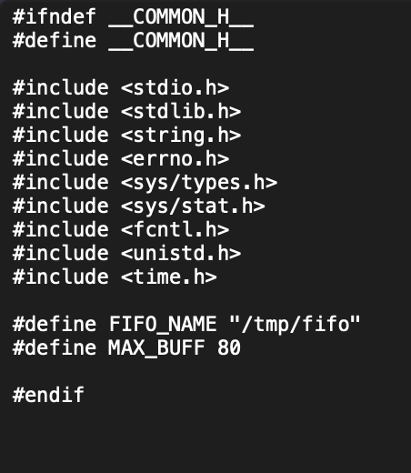
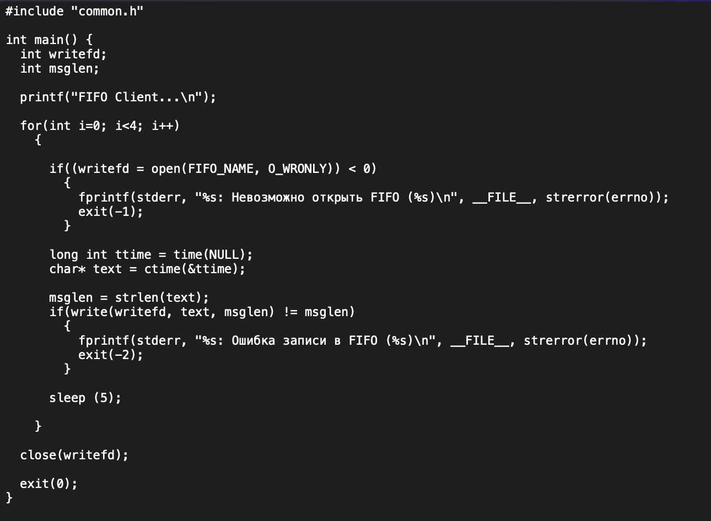
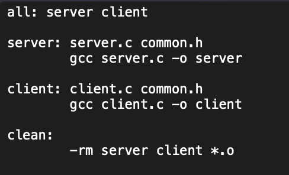
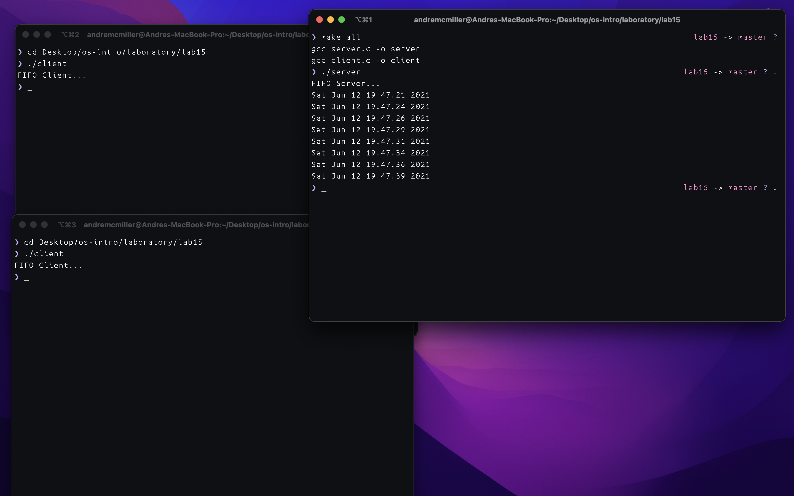

---
## Front matter
lang: ru-RU
title: Отчёт по лабораторной работе №15
author: Миниханов Андрей Русланович
institute: РУДН, Москва, Россия
date: 12 июня 2021

## Formatting
toc: false
slide_level: 2
theme: metropolis
header-includes: 
 - \metroset{progressbar=frametitle,sectionpage=progressbar,numbering=fraction}
 - '\makeatletter'
 - '\beamer@ignorenonframefalse'
 - '\makeatother'
aspectratio: 43
section-titles: true
---

## Цель работы

Приобретение практических навыков работы с именованными каналами.

## Cоздал необходимые файлы

Для начала я создал необходимые файлы с помощью команды «touch common.h server.c client.c Makefile» (рис. -@fig:001) и открыл редактор emacs для их редактирования.

{ #fig:001 width=70% }

## Изменил код common.h

В файл common.h добавил стандартные заголовочные файлы unistd.h и time.h, необходимые для работы кодов других файлов. Common.h предназначен для заголовочных файлов, чтобы в остальных программах их не прописывать каждый раз (рис. -@fig:002).

{ #fig:002 width=70% }

## Изменил код server.c

В файл server.c добавил цикл while для контроля за временем работы сервера. Разница между текущим временем time(NULL) и временем начала работы clock_t start=time(NULL) (инициализация до цикла) не должна превышать 30 секунд (рис. -@fig:003).

{ #fig:003 width=70% }

## Изменил код client.c

В файл client.c добавил цикл, который отвечает за количество сообщений о текущем времени (4 сообщения), которое получается в результате выполнения команд, и команду sleep(5) для приостановки работы клиента на 5 секунд (рис. -@fig:004).

{ #fig:004 width=70% }

## Makefile не изменял

Makefile (файл для сборки) не изменял (рис. -@fig:005).

{ #fig:005 width=70% }

## Скомпилировал необходимые файлы

После написания кодов, я, используя команду «make all», скомпилировал необходимые файлы (рис. -@fig:006).

{ #fig:006 width=70% }

## Проверил работу написанного кода

Отрыл 3 консоли (терминала) и запустил: в первом терминале − «./server», в остальных двух – «./client». В результате каждый терминал-клиент вывел по 4 сообщения. Спустя 30 секунд работа сервера была прекращена (рис. -@fig:007). Программа работает корректно.

{ #fig:007 width=70% }

## Вывод

В ходе выполнения данной лабораторной работы я приобрёл практические навыки работы с именованными каналами.

## {.standout}

Спасибо за внимание!
